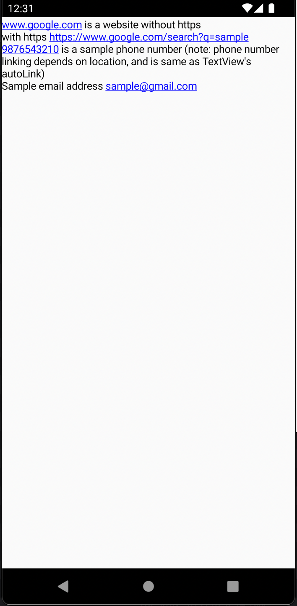

# LinkifyText for Compose

Same as `Text()` composable, but with clickable link support.
When a link is clicked, appropiate intent is fired (Eg: Browsing for Website, Open mail app for emails, etc)

Uses [Linkify](https://developer.android.com/reference/android/text/util/Linkify) for link detection, which is same as that of [TextView](https://developer.android.com/reference/android/widget/TextView)'s [autoLink](https://developer.android.com/reference/android/widget/TextView#attr_android:autoLink).

## Usage

Copy [LinkifyText.kt](https://github.com/firefinchdev/linkify-text/blob/master/linkifytext/src/main/java/com/linkifytext/LinkifyText.kt) in your project.

```
LinkifyText(
    text = text,                        // Text with websites, phone, emails and/or maps
    linkColor = Color.Blue,             // Color of the link
    linkEntire = false,                 // Skip link detection, and link entire text
    clickable = true,                   // false for view-only links
    onClickLink = { clickedLink ->  },  // Optional callback when a link is clicked
    color = Color.Black,                // Non-linked text color

    // Other standard options available on Text Composable
    modifier = ..
    fontSize = ..
    fontStyle = ..
    fontWeight = ..
    fontFamily = ..
    letterSpacing = ..
    textDecoration = ..
    textAlign = ..
    lineHeight = ..
    overflow = ..
    softWrap = ..
    maxLines = ..
    onTextLayout = ..
    style = ..
)
```

## Sample


## License

MIT, see `LICENSE.txt`.
